# VNIndex ML Forecast Benchmark vs MACD

Repo này so sánh khả năng dự báo của MACD 12-26-9 với các mô hình Machine Learning:
SVC, SVR, Random Forest, XGBoost, LightGBM, CatBoost và HMM/Regime Model.

Trọng tâm là dự báo theo 3 khung thời gian:

- Ngắn hạn: 5 phiên
- Trung hạn: 20 phiên
- Dài hạn: 60 phiên

## Dữ liệu và phương pháp

- File gốc: `data.csv`
- Số dòng hợp lệ: `6,298`
- Giai đoạn dữ liệu: `2000-07-28` đến `2026-07-01`
- Biến dự báo: return tương lai `close[t+h] / close[t] - 1`
- Nhãn hướng: tăng nếu return tương lai lớn hơn 0
- Chia tập: theo thời gian, không shuffle, tránh leakage
- Chiến lược tài chính: long/flat; nếu mô hình dự báo tăng thì nắm giữ cho phiên kế tiếp, nếu không thì đứng ngoài
- MACD baseline: `MACD line > Signal line` được xem là tín hiệu bullish để dự báo hướng

## Tối ưu hyperparameter nhẹ

Mỗi mô hình ML/HMM có 4 cấu hình ứng viên cho từng horizon. Việc chọn tham số dùng
TimeSeriesSplit với 3 fold và gap bằng chính horizon trên riêng phần train + validation.
Tập test cuối không tham gia chọn tham số.

Điểm CV tổng hợp gồm 45% Balanced Accuracy, 20% F1, 20% IC score và 15% Sharpe score.
IC và Sharpe được co về thang 0-1 trước khi cộng. Search đã đánh giá
84 tổ hợp model-horizon-candidate, tổng thời gian fit cộng dồn khoảng
4.4 phút. Có 14/21 lựa chọn
rời khỏi cấu hình baseline.

### Tuning có cải thiện thật trên test không?

- Horizon 5 phiên: 2/7 mô hình tăng điểm tổng hợp trên test. Cải thiện lớn nhất là SVR (+0.0119); giảm nhiều nhất là CatBoost (-0.0160).
- Horizon 20 phiên: 1/7 mô hình tăng điểm tổng hợp trên test. Cải thiện lớn nhất là SVR (+0.0081); giảm nhiều nhất là HMM Regime (-0.0167).
- Horizon 60 phiên: 2/7 mô hình tăng điểm tổng hợp trên test. Cải thiện lớn nhất là Random Forest (+0.0081); giảm nhiều nhất là SVC (-0.0359).

Tổng hợp trung bình theo horizon:

| horizon | models | models_improved | mean_delta_composite_score | mean_delta_balanced_accuracy | mean_delta_spearman_ic | mean_delta_strategy_sharpe |
| ------- | ------ | --------------- | -------------------------- | ---------------------------- | ---------------------- | -------------------------- |
| 5       | 7      | 2               | -0.0003                    | 0.0019                       | 0.0028                 | -0.0418                    |
| 20      | 7      | 1               | -0.0056                    | -0.0134                      | 0.0072                 | 0.0201                     |
| 60      | 7      | 2               | -0.0030                    | 0.0004                       | -0.0110                | -0.0498                    |

Chi tiết thay đổi theo mô hình; delta dương nghĩa là tuned tốt hơn baseline trên test:

| horizon | model         | candidate_id | delta_composite_score | delta_rank_score | delta_balanced_accuracy | delta_spearman_ic | delta_strategy_sharpe | improved_composite_score |
| ------- | ------------- | ------------ | --------------------- | ---------------- | ----------------------- | ----------------- | --------------------- | ------------------------ |
| 5       | SVR           | 3.0000       | 0.0119                | 0.1250           | 0.0265                  | 0.0320            | -0.1165               | True                     |
| 5       | SVC           | 1.0000       | 0.0088                | 0.0250           | 0.0066                  | 0.0030            | 0.1333                | True                     |
| 5       | HMM Regime    | 0.0000       | 0.0000                | -0.0250          | 0.0000                  | 0.0000            | 0.0000                | False                    |
| 5       | Random Forest | 0.0000       | 0.0000                | 0.0500           | 0.0000                  | 0.0000            | 0.0000                | False                    |
| 5       | LightGBM      | 2.0000       | -0.0023               | 0.0000           | -0.0012                 | -0.0353           | 0.0215                | False                    |
| 5       | XGBoost       | 2.0000       | -0.0048               | 0.0000           | -0.0058                 | 0.0045            | -0.0979               | False                    |
| 5       | CatBoost      | 2.0000       | -0.0160               | -0.1500          | -0.0130                 | 0.0153            | -0.2330               | False                    |
| 20      | SVR           | 1.0000       | 0.0081                | 0.0500           | -0.0157                 | -0.0711           | 0.6289                | True                     |
| 20      | LightGBM      | 0.0000       | 0.0000                | 0.0500           | 0.0000                  | 0.0000            | 0.0000                | False                    |
| 20      | XGBoost       | 0.0000       | 0.0000                | -0.0250          | 0.0000                  | 0.0000            | 0.0000                | False                    |
| 20      | SVC           | 1.0000       | -0.0054               | -0.0750          | -0.0025                 | -0.0138           | -0.1972               | False                    |
| 20      | Random Forest | 1.0000       | -0.0094               | -0.0250          | -0.0447                 | 0.0102            | 0.5668                | False                    |
| 20      | CatBoost      | 1.0000       | -0.0157               | -0.0250          | -0.0236                 | 0.0579            | -0.1704               | False                    |
| 20      | HMM Regime    | 3.0000       | -0.0167               | 0.0500           | -0.0073                 | 0.0669            | -0.6873               | False                    |
| 60      | Random Forest | 2.0000       | 0.0081                | 0.0500           | 0.0080                  | 0.1015            | 0.0543                | True                     |
| 60      | LightGBM      | 1.0000       | 0.0074                | -0.0250          | 0.0122                  | -0.0513           | 0.0980                | True                     |
| 60      | CatBoost      | 0.0000       | 0.0000                | 0.0250           | 0.0000                  | 0.0000            | 0.0000                | False                    |
| 60      | HMM Regime    | 0.0000       | 0.0000                | 0.0250           | 0.0000                  | 0.0000            | 0.0000                | False                    |
| 60      | SVR           | 0.0000       | 0.0000                | 0.0000           | 0.0000                  | 0.0000            | 0.0000                | False                    |
| 60      | XGBoost       | 1.0000       | -0.0008               | 0.1000           | 0.0159                  | -0.0705           | -0.2201               | False                    |
| 60      | SVC           | 1.0000       | -0.0359               | -0.1500          | -0.0331                 | -0.0567           | -0.2807               | False                    |

Tham số được chọn:

| horizon | model         | candidate_id | cv_score | cv_score_std | selected_params                                                                                                                                 |
| ------- | ------------- | ------------ | -------- | ------------ | ----------------------------------------------------------------------------------------------------------------------------------------------- |
| 5       | CatBoost      | 2            | 0.5677   | 0.0203       | {"depth": 4, "iterations": 360, "l2_leaf_reg": 5.0, "learning_rate": 0.025}                                                                     |
| 5       | HMM Regime    | 0            | 0.5832   | 0.0258       | {"covariance_type": "diag", "n_components": 4, "n_iter": 400}                                                                                   |
| 5       | LightGBM      | 2            | 0.5470   | 0.0226       | {"colsample_bytree": 0.8, "learning_rate": 0.02, "max_depth": 5, "n_estimators": 360, "num_leaves": 20, "reg_lambda": 4.0, "subsample": 0.8}    |
| 5       | Random Forest | 0            | 0.5978   | 0.0230       | {"max_depth": 7, "min_samples_leaf": 20, "n_estimators": 350}                                                                                   |
| 5       | SVC           | 1            | 0.5850   | 0.0271       | {"C": 0.5, "gamma": "scale"}                                                                                                                    |
| 5       | SVR           | 3            | 0.5230   | 0.0278       | {"C": 5.0, "epsilon": 0.005, "gamma": 0.03}                                                                                                     |
| 5       | XGBoost       | 2            | 0.5521   | 0.0161       | {"colsample_bytree": 0.8, "learning_rate": 0.025, "max_depth": 3, "n_estimators": 320, "reg_lambda": 4.0, "subsample": 0.8}                     |
| 20      | CatBoost      | 1            | 0.5204   | 0.0291       | {"depth": 3, "iterations": 220, "l2_leaf_reg": 4.0, "learning_rate": 0.05}                                                                      |
| 20      | HMM Regime    | 3            | 0.5966   | 0.0109       | {"covariance_type": "tied", "n_components": 4, "n_iter": 400}                                                                                   |
| 20      | LightGBM      | 0            | 0.5256   | 0.0362       | {"colsample_bytree": 0.85, "learning_rate": 0.025, "max_depth": 4, "n_estimators": 300, "num_leaves": 15, "reg_lambda": 2.0, "subsample": 0.85} |
| 20      | Random Forest | 1            | 0.5416   | 0.0192       | {"max_depth": 5, "max_features": "sqrt", "min_samples_leaf": 30, "n_estimators": 280}                                                           |
| 20      | SVC           | 1            | 0.5435   | 0.0094       | {"C": 0.5, "gamma": "scale"}                                                                                                                    |
| 20      | SVR           | 1            | 0.5081   | 0.0207       | {"C": 1.0, "epsilon": 0.003, "gamma": "scale"}                                                                                                  |
| 20      | XGBoost       | 0            | 0.5265   | 0.0345       | {"colsample_bytree": 0.85, "learning_rate": 0.035, "max_depth": 3, "n_estimators": 250, "reg_lambda": 2.0, "subsample": 0.85}                   |
| 60      | CatBoost      | 0            | 0.5188   | 0.0645       | {"depth": 4, "iterations": 280, "learning_rate": 0.035}                                                                                         |
| 60      | HMM Regime    | 0            | 0.5900   | 0.0052       | {"covariance_type": "diag", "n_components": 4, "n_iter": 400}                                                                                   |
| 60      | LightGBM      | 1            | 0.5367   | 0.0622       | {"colsample_bytree": 0.9, "learning_rate": 0.04, "max_depth": 3, "n_estimators": 240, "num_leaves": 7, "reg_lambda": 3.0, "subsample": 0.9}     |
| 60      | Random Forest | 2            | 0.5359   | 0.0530       | {"max_depth": 10, "max_features": 0.7, "min_samples_leaf": 12, "n_estimators": 350}                                                             |
| 60      | SVC           | 1            | 0.5032   | 0.0506       | {"C": 0.5, "gamma": "scale"}                                                                                                                    |
| 60      | SVR           | 0            | 0.5210   | 0.0381       | {"C": 5.0, "epsilon": 0.001, "gamma": "scale"}                                                                                                  |
| 60      | XGBoost       | 1            | 0.5406   | 0.0603       | {"colsample_bytree": 0.9, "learning_rate": 0.05, "max_depth": 2, "n_estimators": 200, "reg_lambda": 3.0, "subsample": 0.9}                      |

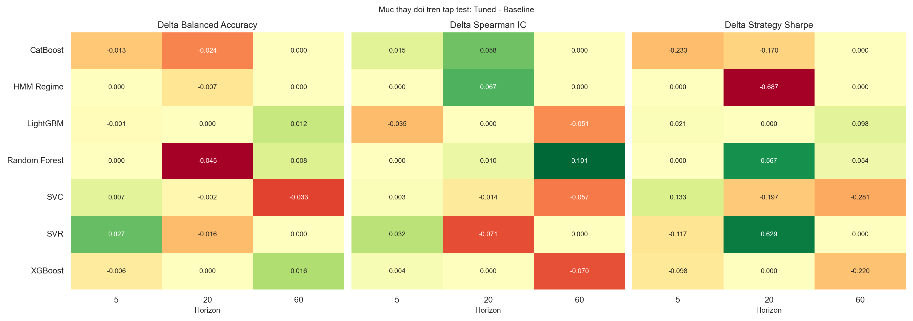

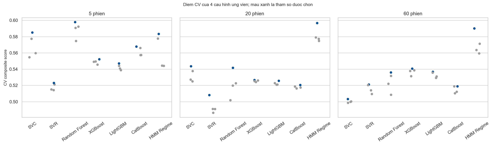

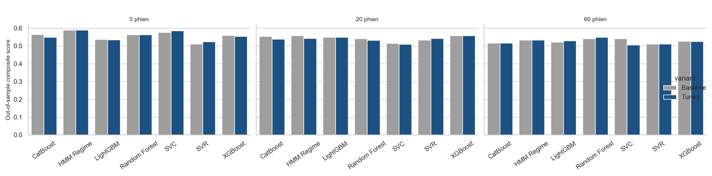

### Split thời gian

| split | rows | start      | end        |
| ----- | ---- | ---------- | ---------- |
| train | 4267 | 2001-05-18 | 2018-11-30 |
| valid | 914  | 2018-12-03 | 2022-08-01 |
| test  | 915  | 2022-08-02 | 2026-04-03 |

## Kết luận nhanh

Top 3 mô hình theo điểm tổng hợp dự báo gồm `balanced_accuracy`, `f1`, `spearman_ic`, `r2` và `strategy_sharpe`:

| horizon | model         | rank_score | balanced_accuracy | f1     | spearman_ic | strategy_sharpe |
| ------- | ------------- | ---------- | ----------------- | ------ | ----------- | --------------- |
| 5       | SVC           | 0.8250     | 0.5283            | 0.6610 | 0.0391      | 1.0803          |
| 5       | HMM Regime    | 0.7500     | 0.5357            | 0.6066 | 0.0479      | 1.5148          |
| 5       | Random Forest | 0.6750     | 0.5173            | 0.6497 | 0.0126      | 0.6789          |
| 20      | MACD 12-26-9  | 0.8000     | 0.5329            | 0.5966 | 0.0338      | 0.9119          |
| 20      | XGBoost       | 0.7000     | 0.5344            | 0.6650 | 0.0137      | 0.2267          |
| 20      | HMM Regime    | 0.6250     | 0.4836            | 0.5751 | 0.0504      | 0.8275          |
| 60      | HMM Regime    | 0.7250     | 0.4392            | 0.6852 | -0.0911     | 0.9145          |
| 60      | Random Forest | 0.7000     | 0.5195            | 0.6177 | -0.0164     | 0.5072          |
| 60      | MACD 12-26-9  | 0.6750     | 0.4658            | 0.5714 | 0.0197      | 0.9119          |

Top 3 mô hình theo Sharpe chiến lược:

| horizon | model         | strategy_total_return | strategy_sharpe | strategy_max_drawdown | strategy_exposure |
| ------- | ------------- | --------------------- | --------------- | --------------------- | ----------------- |
| 5       | HMM Regime    | 0.8485                | 1.5148          | -0.0943               | 0.5727            |
| 5       | SVC           | 0.6746                | 1.0803          | -0.1403               | 0.7126            |
| 5       | MACD 12-26-9  | 0.4274                | 0.9119          | -0.1779               | 0.5344            |
| 20      | Random Forest | 0.7399                | 1.1347          | -0.1198               | 0.6667            |
| 20      | SVR           | 0.5087                | 0.9245          | -0.1503               | 0.4721            |
| 20      | MACD 12-26-9  | 0.4274                | 0.9119          | -0.1779               | 0.5344            |
| 60      | HMM Regime    | 0.5408                | 0.9145          | -0.1291               | 0.7770            |
| 60      | MACD 12-26-9  | 0.4274                | 0.9119          | -0.1779               | 0.5344            |
| 60      | LightGBM      | 0.4773                | 0.8939          | -0.1620               | 0.5169            |

Vị trí của MACD trong bảng dự báo:

| horizon | model        | rank_score | balanced_accuracy | f1     | spearman_ic | strategy_sharpe |
| ------- | ------------ | ---------- | ----------------- | ------ | ----------- | --------------- |
| 5       | MACD 12-26-9 | 0.6750     | 0.5184            | 0.5725 | 0.0254      | 0.9119          |
| 20      | MACD 12-26-9 | 0.8000     | 0.5329            | 0.5966 | 0.0338      | 0.9119          |
| 60      | MACD 12-26-9 | 0.6750     | 0.4658            | 0.5714 | 0.0197      | 0.9119          |

## Dự báo tương lai từ phiên mới nhất

Ngày dự báo mới nhất trong dữ liệu là `2026-07-01`, VNIndex đóng cửa `1,865.37`.
Các mô hình được train lại trên toàn bộ phần lịch sử đã có nhãn cho từng horizon, sau đó dự báo từ trạng thái kỹ thuật mới nhất.

### Nhận xét hướng đi VNIndex

- Horizon 5 phiên đến khoảng `2026-07-08`: đồng thuận `Bullish`, 8/8 mô hình bullish, median return `0.41%`, target median `1,872.96`. Đa số mô hình ủng hộ xu hướng tăng.
- Horizon 20 phiên đến khoảng `2026-07-29`: đồng thuận `Bullish`, 5/8 mô hình bullish, median return `0.59%`, target median `1,876.38`. Đa số mô hình ủng hộ xu hướng tăng.
- Horizon 60 phiên đến khoảng `2026-09-23`: đồng thuận `Mixed/Neutral`, 4/8 mô hình bullish, median return `2.07%`, target median `1,904.04`. Tín hiệu phân hóa, nên ưu tiên quan sát xác nhận.

Bảng đồng thuận tổng hợp:

| horizon | target_date | models | bullish_models | bullish_share | median_pred_return | weighted_pred_return | median_predicted_close | consensus_view |
| ------- | ----------- | ------ | -------------- | ------------- | ------------------ | -------------------- | ---------------------- | -------------- |
| 5       | 2026-07-08  | 8      | 8              | 100%          | 0.41%              | 0.70%                | 1,872.96               | Bullish        |
| 20      | 2026-07-29  | 8      | 5              | 62%           | 0.59%              | 1.06%                | 1,876.38               | Bullish        |
| 60      | 2026-09-23  | 8      | 4              | 50%           | 2.07%              | 2.87%                | 1,904.04               | Mixed/Neutral  |

Top mô hình theo chất lượng backtest dùng để tham khảo dự báo hiện tại:

| horizon | model         | direction_label | pred_return | predicted_close | rank_score | test_balanced_accuracy | test_strategy_sharpe |
| ------- | ------------- | --------------- | ----------- | --------------- | ---------- | ---------------------- | -------------------- |
| 5       | SVC           | Bullish         | 0.0090      | 1882.1837       | 0.8250     | 0.5283                 | 1.0803               |
| 5       | HMM Regime    | Bullish         | 0.0131      | 1889.8550       | 0.7500     | 0.5357                 | 1.5148               |
| 5       | MACD 12-26-9  | Bullish         | 0.0055      | 1875.7155       | 0.6750     | 0.5184                 | 0.9119               |
| 5       | Random Forest | Bullish         | 0.0025      | 1870.1030       | 0.6750     | 0.5173                 | 0.6789               |
| 20      | MACD 12-26-9  | Bullish         | 0.0160      | 1895.2246       | 0.8000     | 0.5329                 | 0.9119               |
| 20      | XGBoost       | Bearish/Flat    | -0.0100     | 1846.7625       | 0.7000     | 0.5344                 | 0.2267               |
| 20      | HMM Regime    | Bullish         | 0.0511      | 1960.6776       | 0.6250     | 0.4836                 | 0.8275               |
| 20      | Random Forest | Bullish         | 0.0053      | 1875.2746       | 0.5750     | 0.4602                 | 1.1347               |
| 60      | HMM Regime    | Bullish         | 0.0625      | 1981.9330       | 0.7250     | 0.4392                 | 0.9145               |
| 60      | Random Forest | Bearish/Flat    | 0.0033      | 1871.4673       | 0.7000     | 0.5195                 | 0.5072               |
| 60      | MACD 12-26-9  | Bullish         | 0.0382      | 1936.6039       | 0.6750     | 0.4658                 | 0.9119               |
| 60      | XGBoost       | Bearish/Flat    | 0.0006      | 1866.4489       | 0.6000     | 0.5015                 | 0.4076               |

Diễn giải nhanh:

- `direction_label` là tín hiệu hướng từ classifier hoặc ngưỡng return dự báo; `pred_return` là mức return kỳ vọng từ regressor/ước lượng regime. Với mô hình vừa classification vừa regression, hai lớp này có thể lệch nhau khi xác suất hướng yếu nhưng return kỳ vọng vẫn hơi dương.
- Nếu `bullish_share` cao nhưng `median_pred_return` nhỏ, thị trường có thiên hướng tăng nhưng biên kỳ vọng chưa mạnh.
- Nếu các mô hình tốt trong backtest đồng thuận với MACD/HMM, tín hiệu đáng chú ý hơn.
- Nếu heatmap phân hóa mạnh giữa mô hình tuyến tính/kernel và mô hình cây/boosting, nên xem đó là trạng thái nhiễu hoặc chuyển regime.

Ảnh dự báo tương lai:

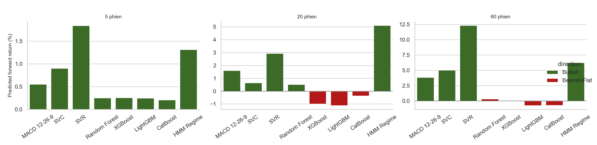

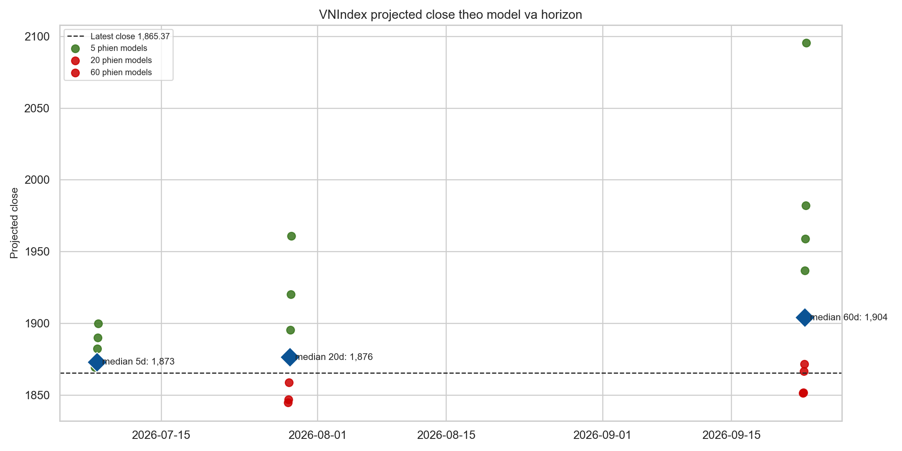

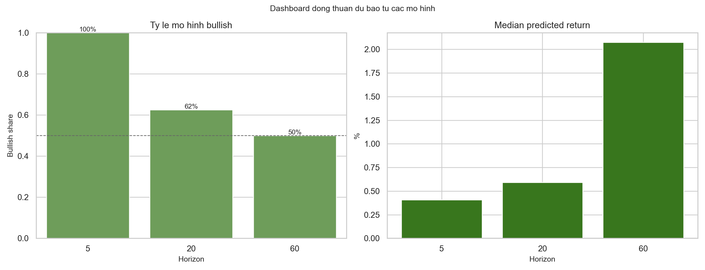

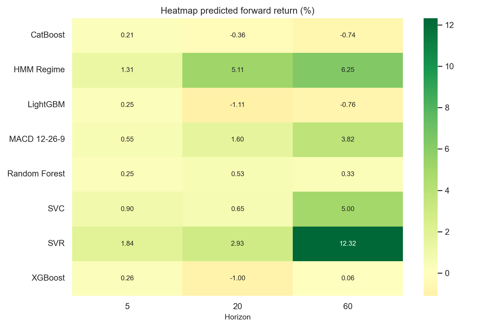

## Chỉ số học máy

Các chỉ số chính:

- `accuracy`: tỷ lệ dự báo đúng hướng tăng/giảm.
- `balanced_accuracy`: accuracy cân bằng giữa lớp tăng và giảm, hữu ích khi thị trường thiên lệch tăng.
- `precision`: khi mô hình báo tăng, tỷ lệ đúng là bao nhiêu.
- `recall`: trong các giai đoạn thực tế tăng, mô hình bắt được bao nhiêu.
- `f1`: cân bằng giữa precision và recall.
- `roc_auc`: khả năng xếp hạng xác suất tăng.
- `mae`, `rmse`, `r2`: sai số dự báo return.
- `spearman_ic`: Information Coefficient dạng rank correlation giữa return dự báo và return thực tế.

Ảnh heatmap:

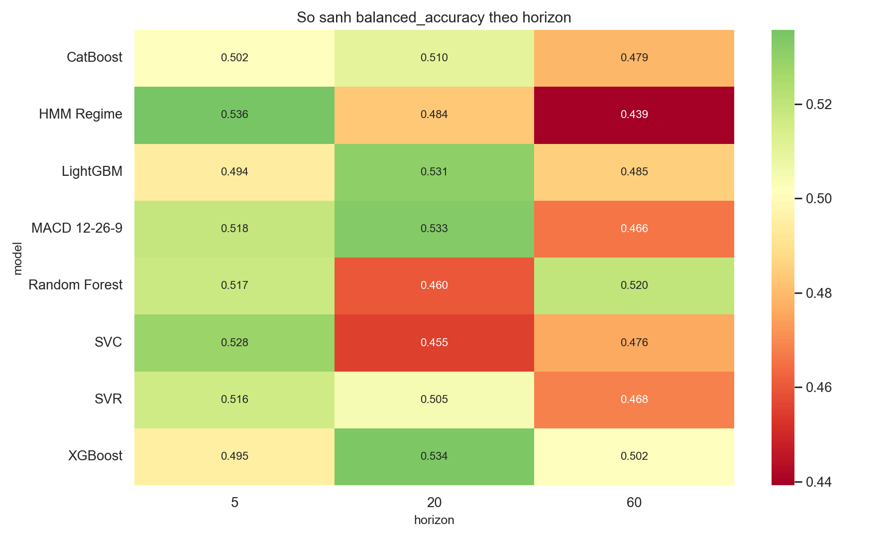

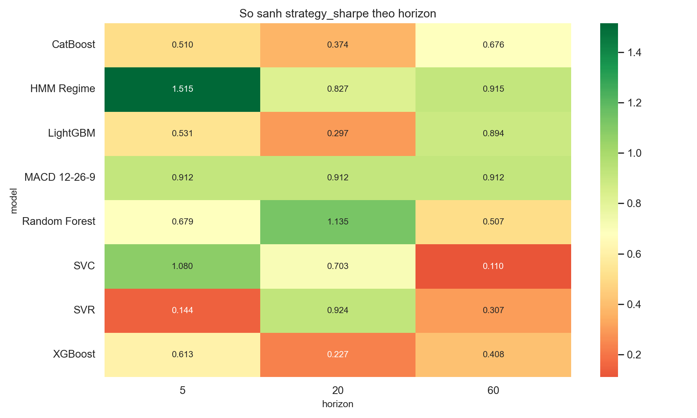

## Chỉ số tài chính

Các chỉ số chính:

- `strategy_total_return`: tổng lợi nhuận chiến lược long/flat trên test.
- `strategy_cagr`: tăng trưởng kép năm hóa.
- `strategy_ann_vol`: biến động năm hóa.
- `strategy_sharpe`: lợi nhuận điều chỉnh rủi ro.
- `strategy_sortino`: Sharpe chỉ phạt downside volatility.
- `strategy_max_drawdown`: mức sụt giảm lớn nhất.
- `strategy_calmar`: CAGR / Max Drawdown.
- `strategy_profit_factor`: tổng lãi / tổng lỗ.
- `strategy_exposure`: tỷ lệ thời gian ở trạng thái long.
- `strategy_turnover`: mức thay đổi vị thế bình quân.
- `strategy_beta_to_buy_hold`, `strategy_alpha_annualized`, `strategy_information_ratio`: so với buy-and-hold.

## Trực quan hóa theo mô hình và horizon

### Tổng quan giá, MACD và RSI


### Equity curves

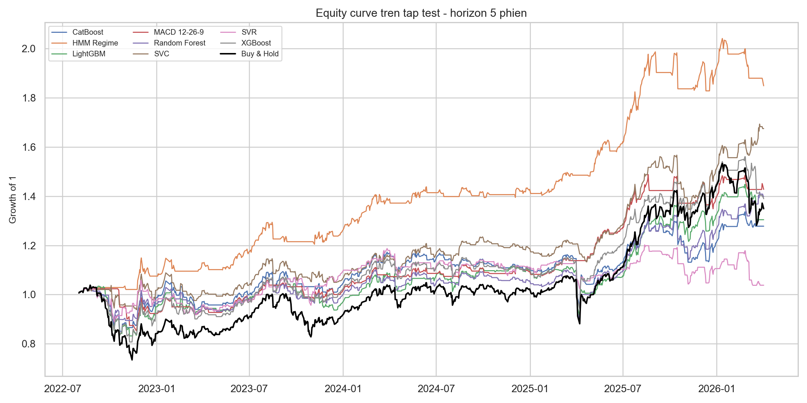

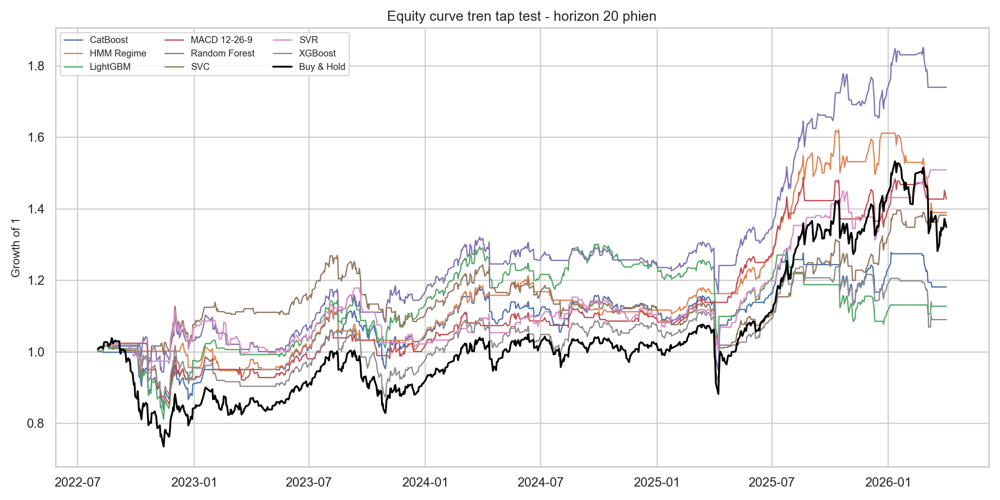

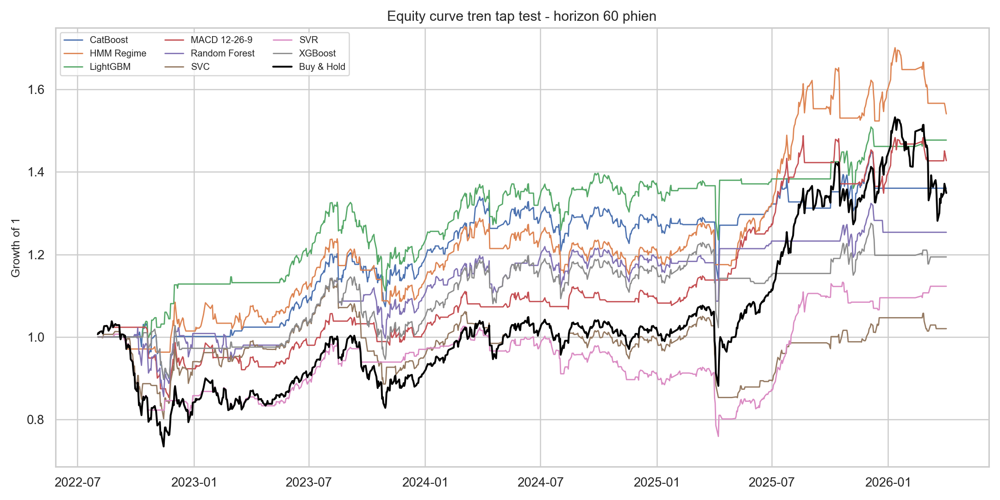

### Forecast panels

Mỗi panel hiển thị return tương lai thực tế, return dự báo và vùng xanh là giai đoạn mô hình chọn long.

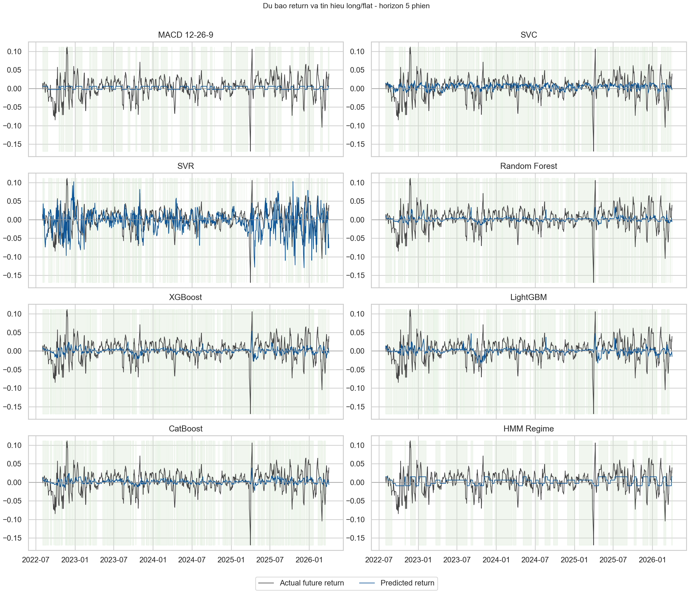

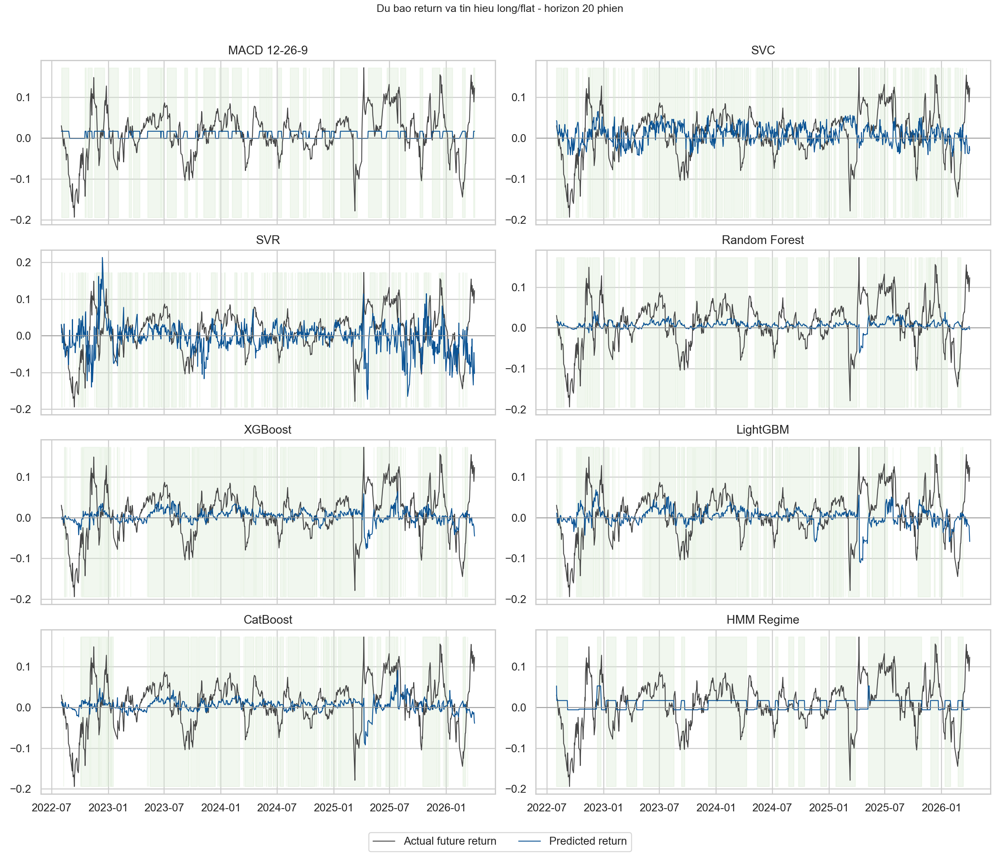

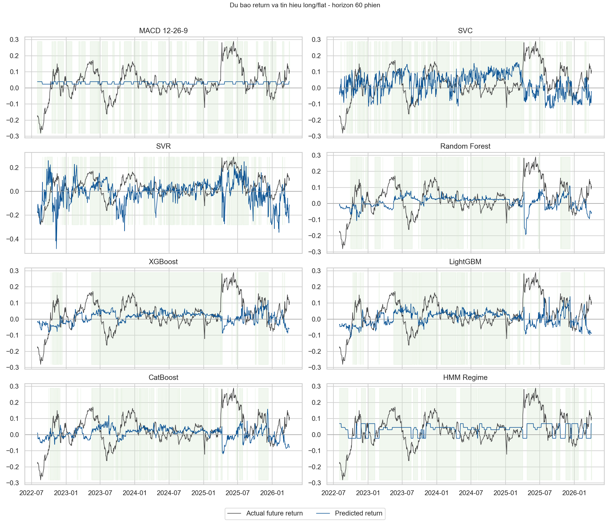

### Feature importance

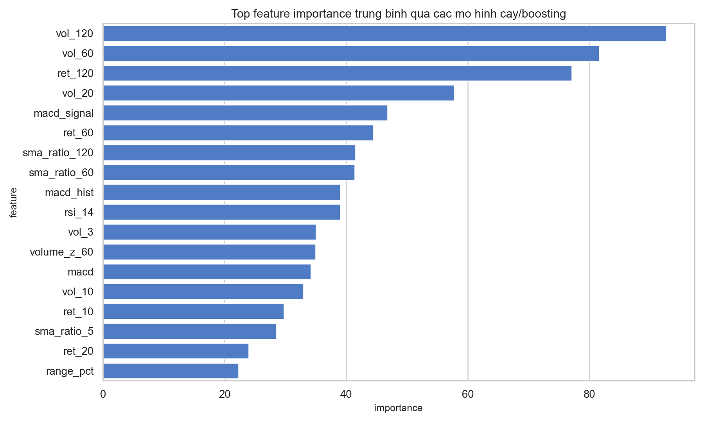

## Cách chạy lại

```bash
/home/namngyh/miniconda3/envs/eda/bin/python run_benchmark.py
```

Kết quả được ghi vào `outputs/`:

- `metrics_by_horizon.csv`: chỉ số học máy theo mô hình và horizon.
- `financial_metrics_by_horizon.csv`: chỉ số tài chính theo mô hình và horizon.
- `model_ranking.csv`: bảng xếp hạng tổng hợp.
- `predictions.csv`: dự báo từng ngày trên tập test.
- `future_forecasts.csv`: dự báo tương lai từ phiên mới nhất theo từng mô hình.
- `future_consensus.csv`: bảng đồng thuận tương lai theo horizon.
- `current_regime_forecast.csv`: regime hiện tại từ HMM theo từng horizon.
- `feature_importance.csv`: top feature importance của các mô hình cây/boosting.
- `regime_summary.csv`: trạng thái HMM và return kỳ vọng theo regime.
- `figures/*.png`: toàn bộ biểu đồ.

Các file tuning bổ sung:

- baseline metrics, financial metrics, predictions và ranking: kết quả cấu hình trước tuning trên cùng tập test.
- tuning_trials.csv: toàn bộ 84 trial và điểm cross-validation.
- best_hyperparameters.csv: tham số thắng cho từng model và horizon.
- tuning_comparison.csv: so sánh out-of-sample baseline với tuned.

## Lưu ý diễn giải

Kết quả này là out-of-sample theo split thời gian, nhưng vẫn là nghiên cứu lịch sử. Search nhẹ
giảm chi phí tính toán nhưng không đảm bảo mọi mô hình đều tốt hơn trên test; chính các delta âm
trong bảng là bằng chứng cần giữ lại thay vì chỉ báo cáo mô hình thắng. Nếu dùng giao dịch thật cần
bổ sung transaction cost, slippage, nested/walk-forward retraining, kiểm định ổn định theo từng
regime và quản trị rủi ro vị thế.
